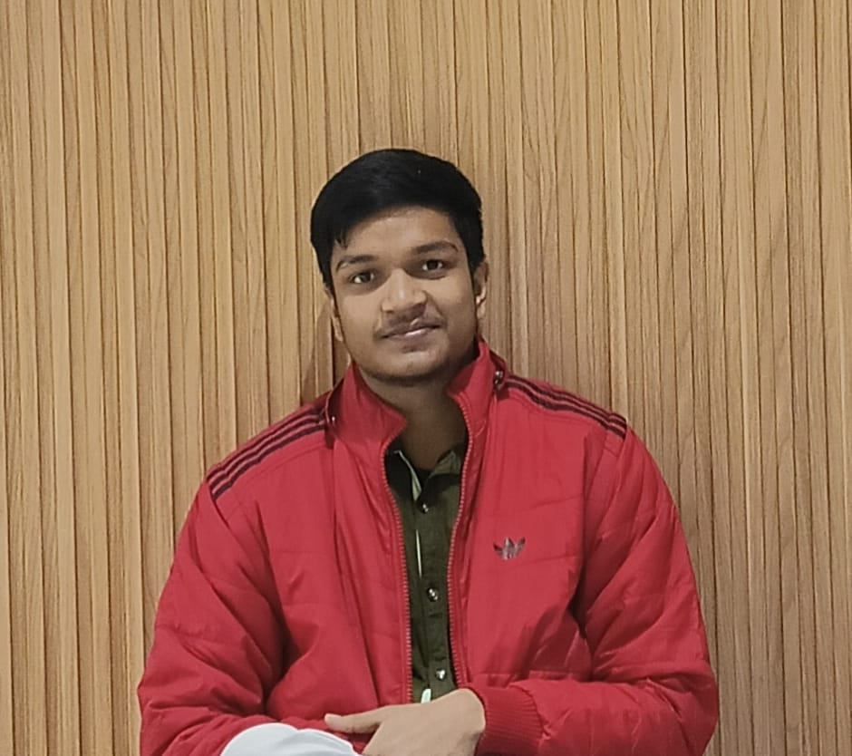

# 🌐 Personal Portfolio Website

This repository contains my **personal responsive portfolio website**, designed to showcase my skills, projects, and professional profile as a **Full Stack Developer & AI Enthusiast**.

---

## 👨‍💻 About Me

Hi 👋
I'm **Gulshan Kumar Singh**, a Computer Science and Engineering student (B.Tech 2023–2027).

I am passionate about:

* Building scalable web applications
* Developing real-time systems
* Working with cloud and AI-powered technologies

This portfolio represents my journey, skills, and projects.

---

## 🚀 Portfolio Features

* ✅ Fully responsive (Mobile, Tablet, Desktop)
* ✅ Clean & modern UI design
* ✅ Fixed navigation bar
* ✅ Profile photo section
* ✅ Projects with detailed descriptions
* ✅ Clickable links (GitHub, LinkedIn, Email)
* ✅ Easy deployment on GitHub Pages / Vercel / Netlify

---

## 🛠️ Tech Stack Used

* HTML5
* CSS3
* Responsive Web Design

---

## 📂 Website Sections

* About Me
* Skills
* Projects
* Contact

---

## 📸 Portfolio Preview

> You can replace this image later with a full website screenshot.

---

## 💼 Projects Included

### 🔹 SyncPad – Real-Time Collaborative Code Editor

* Supports 50+ concurrent users
* Real-time sync using WebSockets & WebRTC
* Integrated Judge0 API for code execution
* CI/CD pipeline using GitHub Actions

### 🔹 AI Website Builder

* No-code website generation using AI
* Gemini API powered
* Live WYSIWYG editor

### 🔹 SmartSQL

* Converts natural language into SQL queries
* Built using LangChain and Gemini
* Optimized backend with caching and indexing

---

## 🔗 Important Links

* **GitHub:** [https://github.com/gulshan-0987654321](https://github.com/gulshan-0987654321)
* **LinkedIn:** [https://www.linkedin.com/in/gulshan-kumar-singh-136a5b336/](https://www.linkedin.com/in/gulshan-kumar-singh-136a5b336/)
* **Email:** [gulshankumarsingh849@gmail.com](mailto:gulshankumarsingh849@gmail.com)

---

## 📌 How to Use

1. Clone the repository
2. Open `index.html` in your browser
3. Or deploy using GitHub Pages / Vercel / Netlify

---

## ⭐ Acknowledgement

This portfolio is continuously evolving as I learn and build new projects.
Feel free to explore and connect with me!

---

© 2026 Gulshan Kumar Singh
